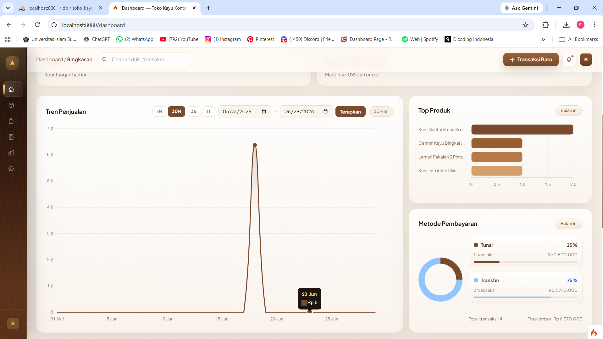
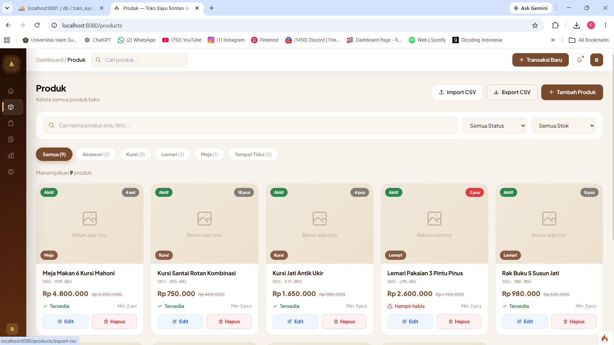
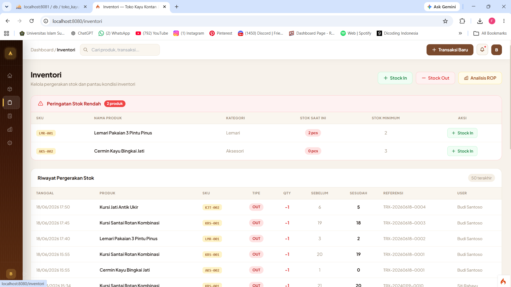
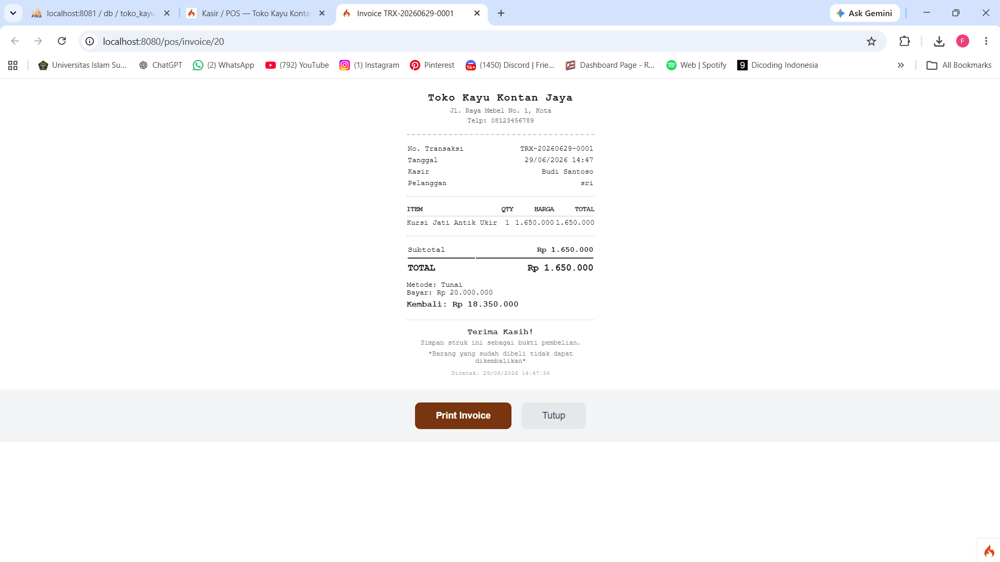
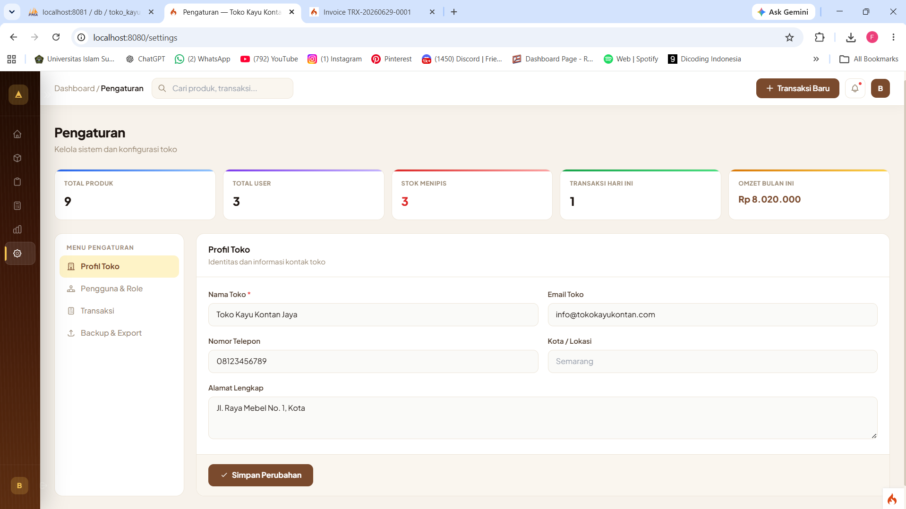

# SIM Toko Kayu Kontan Jaya

Sistem informasi penjualan dan manajemen inventori yang dikembangkan untuk membantu operasional UMKM Toko Kayu Kontan Jaya.

## Tentang studi kasus

**Mitra:** Toko Kayu Kontan Jaya
**Alamat:** Jl. Kalijajar Singorejo, Kec. Demak, Kabupaten Demak, Jawa Tengah 59513
**Jenis proyek:** Capstone Project — studi kasus digitalisasi UMKM
**Judul:** Implementasi Point of Sale untuk Manajemen Persediaan Stok dan Pelaporan Penjualan Real-Time Berbasis Web

Project ini membantu toko mengelola aktivitas harian secara lebih terstruktur, mulai dari pencatatan produk dan stok, proses penjualan di kasir, hingga pemantauan omzet dan laporan. Sistem dirancang untuk menjawab kebutuhan operasional UMKM yang membutuhkan data inventori dan transaksi yang mudah dipantau dalam satu aplikasi.

## Latar Belakang

Proyek ini dikembangkan untuk membantu UMKM Toko Kayu Kontan Jaya mengelola penjualan, persediaan, transaksi kasir, dan laporan secara lebih terstruktur melalui satu sistem berbasis web.

### Masalah awal UMKM

Sebelum sistem dibuat, pencatatan stok, transaksi penjualan, dan rekap laporan masih dilakukan secara manual menggunakan buku dan nota tulis tangan. Kondisi ini menyulitkan pemantauan stok secara real-time, meningkatkan risiko selisih data antara penjualan dan persediaan, serta memperlambat penyusunan laporan. Hak akses antara pemilik, admin, dan kasir juga belum terdokumentasi dengan jelas.

### Proses pengumpulan kebutuhan

Kebutuhan sistem dikumpulkan melalui observasi alur kerja toko dan wawancara dengan pemilik serta karyawan Toko Kayu Kontan Jaya. Temuan tersebut kemudian diterjemahkan menjadi kebutuhan modul autentikasi, produk, inventori, POS, transaksi, laporan, pengaturan, dan API.


### Kontribusi Saya

Kontribusi saya yang tercatat pada repositori ini adalah:

- Menyusun dokumentasi studi kasus UMKM, latar belakang masalah, proses pengumpulan kebutuhan, status implementasi, dan dampak sistem.
- Menambahkan screenshot modul aplikasi dari laporan capstone ke repository agar fitur dapat ditinjau langsung.
- Memperbarui identitas lokasi Toko Kayu Kontan Jaya pada halaman login dan dashboard.
- Mendokumentasikan batasan keamanan `env.docker` untuk kebutuhan development/demo lokal.

### Status implementasi

Sistem telah diimplementasikan sebagai aplikasi web dan diuji menggunakan Black Box Testing. Laporan mencatat seluruh skenario uji utama berstatus valid dan sistem dinyatakan layak digunakan oleh mitra. Repository ini menyediakan environment Docker untuk demo dan pengembangan lokal; status deployment production/cloud belum diklaim.

### Dampak yang dapat dibuktikan

Hasil pengujian dan implementasi menunjukkan bahwa sistem menyediakan pencatatan stok terintegrasi, peringatan Reorder Point, checkout yang memperbarui stok, nota transaksi, serta ekspor laporan CSV/PDF. Dampak yang didukung oleh laporan adalah peningkatan akurasi pencatatan, percepatan transaksi, dan kemudahan pemantauan; belum ada metrik kuantitatif sebelum-sesudah yang dilaporkan.

## Screenshot aplikasi

Screenshot berikut diambil dari Bab IV laporan capstone dan menampilkan hasil implementasi aplikasi:

| Modul | Preview |
| --- | --- |
| Login |  |
| Dashboard |  |
| Produk |  |
| Inventori & ROP |  |
| POS/Kasir |  |
| Transaksi & invoice |  |
| Laporan |  |
| Pengaturan |  |

### Nilai yang diberikan

- Mengurangi pencatatan stok dan transaksi secara manual.
- Membantu pemilik memantau penjualan, laba, dan produk dengan stok rendah.
- Mempercepat proses transaksi melalui modul POS kasir.
- Menyediakan laporan penjualan yang dapat digunakan sebagai bahan evaluasi usaha.
- Memisahkan akses berdasarkan peran owner, admin, dan kasir.

## Pendekatan pengembangan

Sistem dikembangkan menggunakan metode Waterfall dengan framework CodeIgniter 4, PHP, dan MySQL. Pengujian fungsional dilakukan menggunakan Black Box Testing. Untuk menjaga konsistensi stok ketika terjadi transaksi bersamaan, proses checkout menggunakan transaksi basis data dan row locking.

## Fitur utama

- Autentikasi berbasis role: owner, admin, dan cashier
- Dashboard statistik penjualan dan inventori
- Manajemen produk dan kategori
- Import/export produk melalui CSV
- Pencatatan stok masuk dan stok keluar
- POS kasir dengan invoice transaksi
- Laporan penjualan dan export PDF/CSV
- REST API untuk produk, transaksi, inventori, dan dashboard
- Docker Compose dengan MySQL dan phpMyAdmin

## Menjalankan dengan Docker

Persyaratan: Docker Desktop aktif.

```bash
docker compose up -d --build
```

| Layanan | URL |
| --- | --- |
| Aplikasi | http://localhost:8080 |
| phpMyAdmin | http://localhost:8081 |
| MySQL dari host | `localhost:3307` |

Login demo:

| Role | Email | Password |
| --- | --- | --- |
| Owner | owner@tokokayukontan.com | password123 |
| Kasir | kasir1@tokokayukontan.com | password123 |

> Kredensial di atas hanya untuk development/demo. Ganti sebelum deployment production.

## Perintah pengembangan

```bash
docker compose ps
docker compose logs -f app
docker compose exec app php spark routes
docker compose down
```

Database awal dibuat otomatis oleh MySQL saat volume database pertama kali dibuat. Untuk mengulang database development dari awal:

```bash
docker compose down -v
docker compose up -d --build
```

Perintah `down -v` menghapus data database Docker lokal.

## Struktur project

```text
├── app/                  # Source code CodeIgniter: config, controllers, models, views
├── database/             # SQL untuk inisialisasi database Docker
├── docker/               # Konfigurasi web server Apache
├── docs/                 # API, ERD, spesifikasi, dan panduan teknis
├── public/               # Document root dan asset publik
├── scripts/              # Script backup dan restore
├── tests/                # Unit dan feature tests
├── writable/             # Cache, log, session, dan upload runtime
├── Dockerfile
├── docker-compose.yml
├── composer.json
└── env.docker
```

Dokumentasi teknis tersedia di [docs/](docs/) dan endpoint API di [docs/API.md](docs/API.md).

## Stack

- PHP 8.3
- CodeIgniter 4
- MySQL 8.0
- Apache
- phpMyAdmin
- PHPUnit
